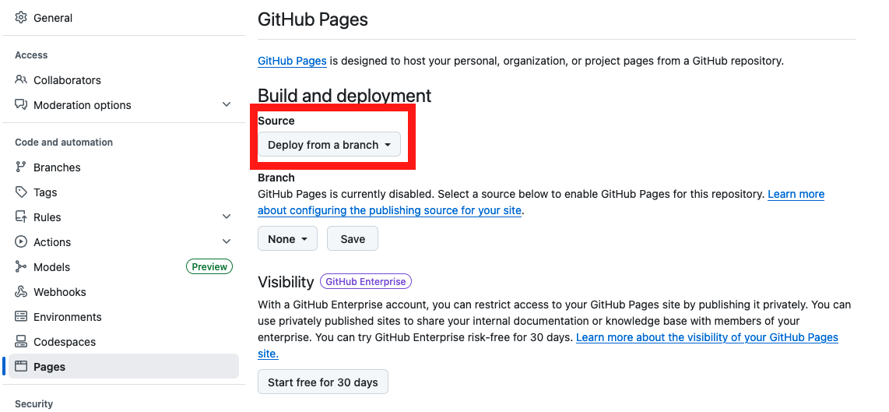
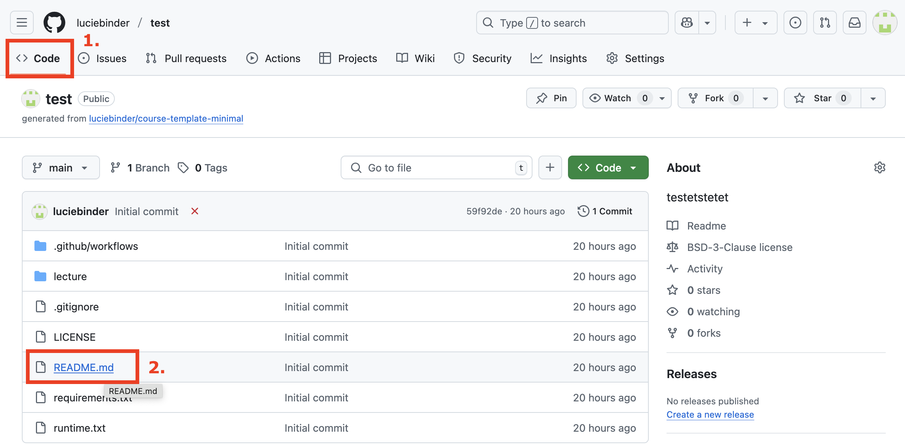
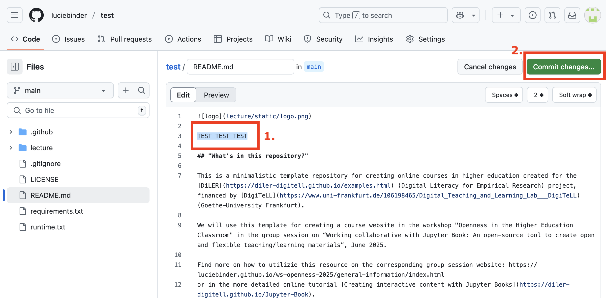
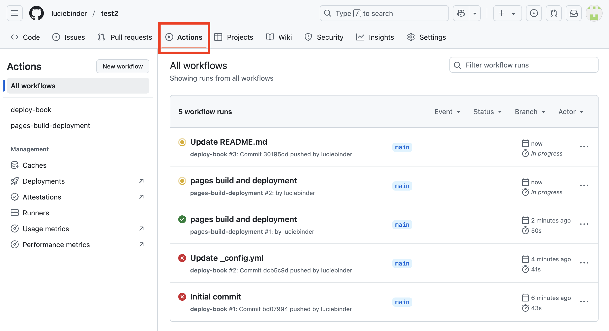

# Hosting Your Course Website

Now that you have created your own course repo based on the course template, you will learn how to actually turn your course files into a website. To do this, we'll be using **Github Pages**. GitHub Pages allows users to host websites directly from their GitHub repos, creating a website for their personal portfolio, project documentation, or, in this case, course content. 

The website is generated directly from the contents of your GitHub repo and is automatically updated whenever changes are made to the repository. 

## Goals
This chapter aims to include the following goals:

1. Learn how to host a website using GitHub pages
2. Learn some common error warnings and how to troubleshoot them 

## Setting up GitHub Pages
Normally, you'd have to set up a ["GitHub-pages-actions"](https://github.com/marketplace/actions/github-pages-action) script for the website to be automatically built on push, but the course template already contains everything you need. 

Please take a closer look at the `.github/workflows` folder, where you'll find a file called `book.yml`. This file already contains all the instructions necessary for GitHub to build your book automatically. All you need to do now is change a few of the settings of your online repo. 

### Setting Up Your Website

1. Open your repository in your browser and click on "Settings" in the top tab, located on the far right.

2. Click on "Pages" under "Code and automation" on the left side.

3. Under Source, make sure that "Deploy from a branch" is selected.

 

4. Under Branch: Select branch “main”. The folder “/root” is automatically selected.

This should look like this now. Don't forget to click on save.

5. Click on "Action" and then "General" under "Code and automation".

6. At the bottom of the page, under "Workflow permissions," select the option "Read and write permissions" and allow Github Actions to create and approve pull requests. Then, click on save.

7. Push a new commit to your repo, i.e. make a change to one file.

Let's do this together by adding some text to the `README` file, a file that entails some main information on your course. 

Click on "Code" to get back to your file structure. Then, click on the `README` file. 

Click on the "edit" symbol: 

Enter some text and click on "commit changes" when you're done.

Commit the changes and add some descriptions about your changes:

Great! Now you changed one file and GitHub Pages starts running a workflow in the background. Let's check the worflows!

### Checking Your Workflow

Next, click on "Actions" at the top of your repository. 

You should see a workflow named "pages build and deployment" running. By clicking on this workflow, you'll be able to view a summary of the process. In the image below, the process is complete, as shown by the green checkmark:

### One Last Adjustment

Once that process has been completed head back over to "Settings" -> "Pages". Select "gh-pages" (instead of "main") as branch.
    

To activate this change, you need to make one final commit to your repository. Just add another line or text to the `README` file, as you just did in Step 7 (see above).

As soon as you committed your changes and the workflow under "Actions" shows a green checkmark, you can refresh your website! 

### Getting Your Link

As soon as you committed your changes and the workflow under "Actions" shows a green checkmark, you can go back to "Settings" -> "Pages". Under "GitHub Pages", you should now find a field that looks like this:

Click on the link to view your freshly built content website! 

**That's it! Congratulations to your first course website!**

## Next Section:
In the next section, you will learn how to identify failed workflows and how to troubleshoot common errors.
