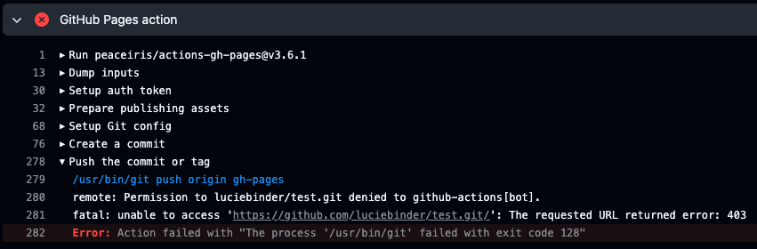
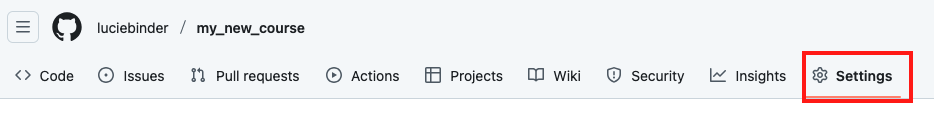
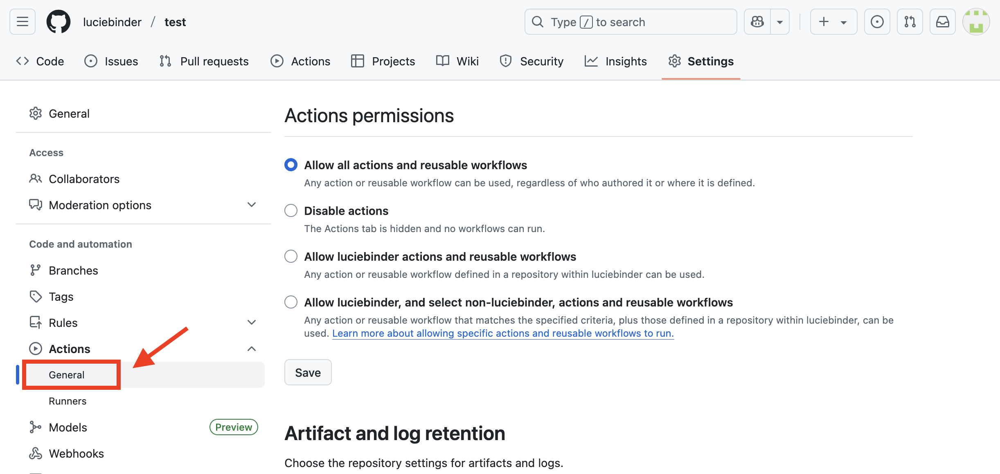
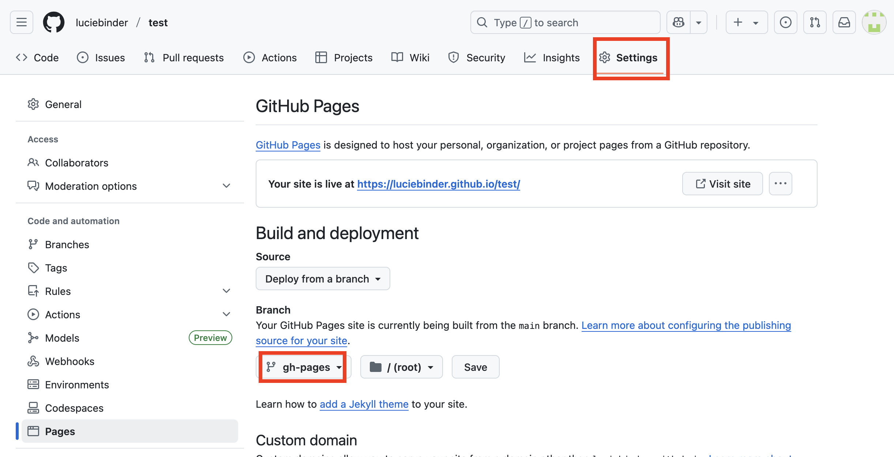

# Troubleshooting

If, for whatever reason, the "pages and deployment" workflow fails, it will be marked with a red `x` instead of a green
checkmark.

Clicking on the failed workflow will reveal which process has failed, in this case, the "build" process.

Clicking on the process will reveal a detailed log of which part of the process failed. Debugging this can be quite unintuitive. 

Therefore, we will show you some common errors and solutions. If the recommended solutions do not work or your error is not mentioned, feel free to contact us either via opening an [Issue](https://docs.github.com/en/issues/tracking-your-work-with-issues/creating-an-issue) on the [course template repo](https://github.com/M-earnest/course_template_diler) or e-mail and we'll try to get back to you ASAP.

## Common Errors

### Missing Workflow Persmissions
If you see this: `Error: Action failed with "The process '/usr/bin/git' failed with exit code 128"`, you should check the workflow permissions and the branch that GitHub Pages uses.

1. Click on "Settings" in the top tab.

2. Click on "Action" and then "General" under "Code and automation" on the left side.

3. At the bottom of the page, under "Workflow permissions," select the option "Read and write permissions" and allow Github Actions to create and approve pull requests. Then, click on save.
 

4. Make a change to one file (e.g., add a line to your `README.md`) to trigger the workflow.

5. Click on "Action" in the top tab and check your workflow.
6. As soon as the process is completed,  head over to “Settings” -> “Pages”.
7. Ensure that "gh-pages" is selected (instead of "main") as the branch.

## Next Chapter:
On the next chapter, you will master the basics of creating and editing files, formatting with Markdown, and embedding media.
