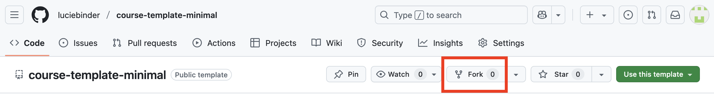
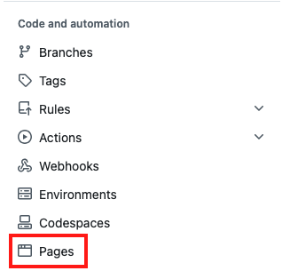
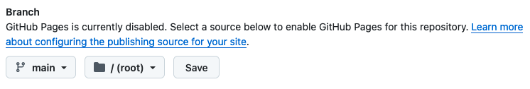
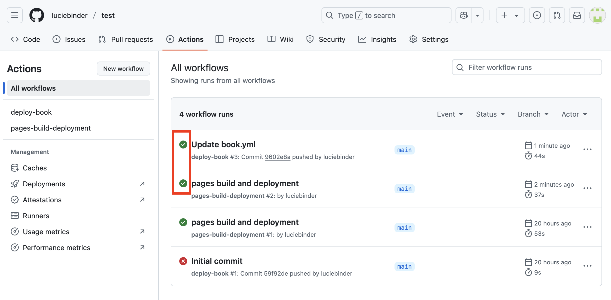
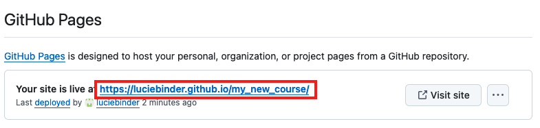

# Quick Setup Guide 

Got some experience setting up a Jupyter Book, or just want the quickest way to get your own course website up and running? This page is for you. While we can't cover everything in just 10 steps, we've condensed the process of creating and hosting your Jupyter Book course website. **Click on the section titles to dive into the detailed tutorials**.

## 1. [Set up your GitHub account](../1_github/account)
First things first: If you don't have a GitHub account yet, head over to github.com and sign up. 

Choose your username carefully, as your username will be included in the link to the website we’re going to build and will be publicly displayed! 

## 2. [Copy our course template](../1_github/project)

1. Go to the GitHub page of our [course template](https://github.com/luciebinder/course-template-minimal) and click on "fork".

2. Give your course a name and a description, check the box "Copy the main branch only," and click the "Create fork" button.

## 3. [Create content](../3_create/intro)

Open the existing Markdown (.md) or Jupyter notebook (.ipynb) files and copy your interactive content and code. Make sure to give each file a meaningful name and add a title to each page.

## 4. [Update Table of Contents](../3_create/setup-files)

Once you've created files, open the `_toc.yml`. Add your newly created files in the sequence of your choice according to our template

## 5. [Update the config and README files](https://diler-digitell.github.io/tutorial_jupyter_books/content/1_github/template.html#make-your-first-adjustments)

1. Open the `_config.yml` file and change the title, author, and the location of your GitHub repository.
2. Open the `README.md` file and update the information on your course.

## 6. [Host your course website](../2_host/host_website)

1. Open your repository in your browser and click on “Settings”.

2. Click on "Pages" under "Code and automation".

3. Under Source, select "Deploy from a branch".

4. Under Branch: Select branch “main”, select the “/root” folder and save.

This should look like this now. Don't forget to click on save.

5. Click on "Action" and then "General" under "Code and automation".

6. At the bottom of the page, under "Workflow permissions," select the option "Read and write permissions" and allow Github Actions to create and approve pull requests. Then, click on save.

7. Push a new commit to your repo, i.e. make a change to one file (e.g., add a line to your README.md).

8. Click on "Actions" at the top of your repository. You should see a workflow named "pages build and deployment" running. Wait until the process is complete, indicated by a green checkmark.

9. Go back to "Settings", and then "Pages". Select "gh-pages" (instead of "main") as branch.

10. Finally, on the top of this Setting page, under "GitHub Pages", you should now find a field that looks like this:

Click on the link to view your freshly built content website! 

Once you're ready, make sure to make your repository public so that others can view your beautiful website.

